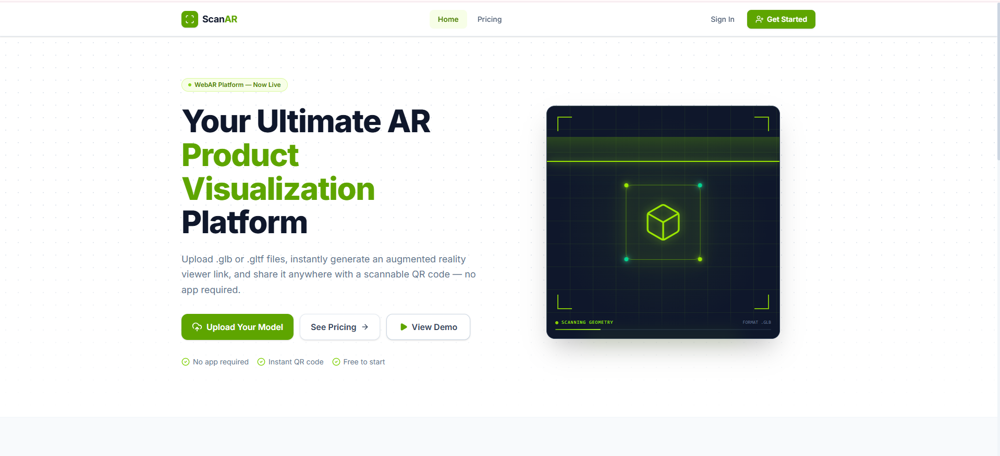
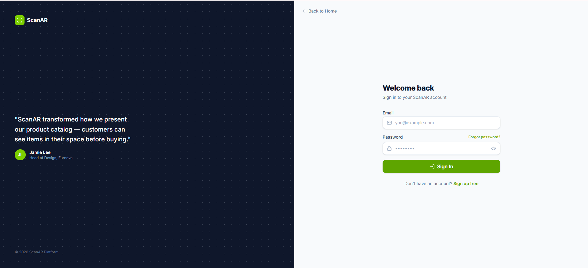
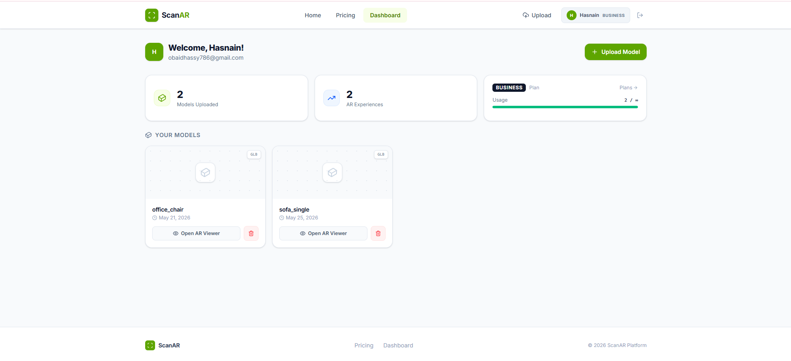
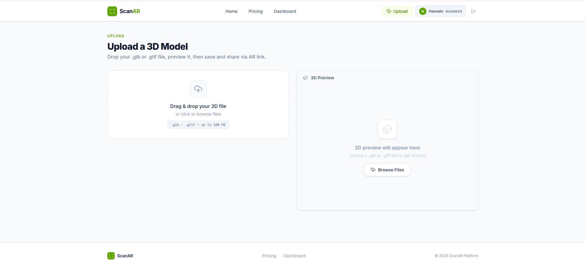
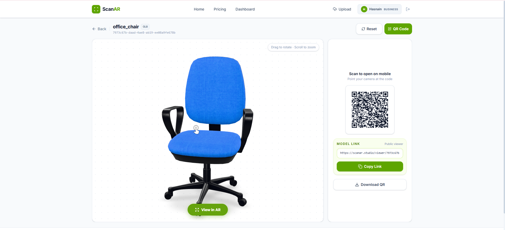

**ScanAR Studio**

A Web-Based Platform for Uploading, Managing, and Viewing 3D Models in Augmented Reality

------------------------------------------------------------------------------

**Overview**

ScanAR Studio is a web-based platform that enables businesses and individuals to upload, manage, and share 3D models for Augmented Reality (AR) viewing.

The platform provides a simple workflow where users can securely upload GLB models, organize them in a personal dashboard, and generate QR codes that allow anyone to instantly view the models in WebAR using a compatible mobile device.

ScanAR Studio aims to make AR product visualization more accessible without requiring users to install a mobile application.

------------------------------------------------------------------------------

**Problem Statement**

Many businesses, especially small and medium-sized businesses, struggle to showcase their products in an interactive way.

Traditional product images often fail to give customers a realistic understanding of an item's size, appearance, or placement.

ScanAR Studio addresses this challenge by allowing businesses to upload 3D product models and share them through QR codes, enabling customers to preview products in Augmented Reality directly from their web browser.

------------------------------------------------------------------------------

**Live Demo**


https://scanar.studio

You can also view demo video on homepage.

------------------------------------------------------------------------------

**Features**

**Authentication**

- User Registration
- Secure Login
- Email Verification
- Forgot Password
- Reset Password
- Protected Dashboard

**Dashboard**

- Personal Dashboard
- Upload GLB Models
- Manage Uploaded Models
- Delete Models
- View Uploaded Models

**3D Model Management**

- Upload GLB Files
- Securely Store 3D Models
- Generate Unique QR Codes
- Access Models Anytime

**AR Experience**

- View Models in WebAR
- QR Code-Based AR Viewing
- Mobile Responsive Interface
- Compatible with supported Android and iOS browsers

**Security**

- Secure User Authentication
- Password Hashing
- HTTP-only Cookies
- Protected API Routes
- Environment Variables for Sensitive Credentials

------------------------------------------------------------------------------

**AI Feature**

The current version of ScanAR Studio focuses on providing a complete platform for uploading, managing, and viewing 3D models in Augmented Reality.

While the application does not currently include AI functionality, its architecture has been designed to support future AI-powered capabilities such as 3D model generation, model optimization, and intelligent processing.

------------------------------------------------------------------------------

**Technologies Used**

**Frontend**

- React
- TypeScript
- Vite
- React Router
- Tailwind CSS

**Backend**

- Node.js
- Express.js
- TypeScript

**Database**

- PostgreSQL
- Drizzle ORM
- Supabase

**Storage**

- Supabase Storage

**Hosting**

- Vercel
- Render

**Authentication**

- JWT
- HTTP-only Cookies
- Resend Email Verification

**Libraries**

- model-viewer
- QR Code Generator
- WebXR

------------------------------------------------------------------------------

**Screenshots**

Home Page



Login Page



Dashboard



Upload Model



QR Code



AR Viewer


------------------------------------------------------------------------------

**How to Run the Project**


The application is deployed and can be accessed using the live URL below:

https://scanar.studio

For local development, clone the repository, install the project dependencies using npm install, configure the required environment variables, and start the frontend and backend development servers.

------------------------------------------------------------------------------

**Environment Variables**


This project uses environment variables to securely store configuration values such as database connections, authentication secrets, and third-party service credentials.

These files are intentionally excluded from the repository to protect sensitive information.

------------------------------------------------------------------------------

**Project Structure**

```
Frontend
├── Components
├── Pages
├── Hooks
├── Services
├── Assets

Backend
├── Routes
├── Controllers
├── Middleware
├── Database
├── Authentication
```

------------------------------------------------------------------------------

**Future Improvements**

The following features are planned for future versions of ScanAR Studio:

- AI-powered 3D model generation
- Image-to-3D conversion
- AI-assisted model optimization
- Subscription plans
- Team collaboration
- Product analytics
- Public model gallery
- Advanced dashboard
- Multi-language support

------------------------------------------------------------------------------

**Author**

Hasnain Iftikhar

Developed as the Final Project for the ACTAI Course.

ScanAR Studio is an original project and an ongoing startup focused on making Augmented Reality more accessible for businesses through modern web technologies.

------------------------------------------------------------------------------

**License**

This repository is private and has been shared only with the course instructor for academic evaluation with permission from the ACTAI team.

All rights reserved © Hasnain Iftikhar.
